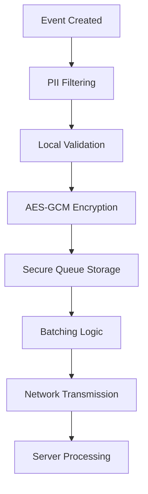

# Privacy & Security Guide

Comprehensive guide to LuxAnalytics' privacy-first architecture and security features.

## Privacy-First Design

LuxAnalytics is built from the ground up with privacy as a core principle, not an afterthought.

### Core Privacy Principles

1. **Data Minimization** - Collect only what's necessary
2. **Automatic PII Protection** - Built-in filtering of sensitive data
3. **User Control** - Easy opt-out and data management
4. **Transparency** - Clear documentation of what's collected
5. **Local-First** - Data processed locally when possible

## Automatic PII Filtering

### What Gets Filtered

LuxAnalytics automatically detects and redacts:

| Data Type | Pattern | Replacement |
|-----------|---------|-------------|
| **Email addresses** | `user@example.com` | `<email>` |
| **Phone numbers** | `+1-555-123-4567` | `<phone>` |
| **Credit card numbers** | `4111 1111 1111 1111` | `<card>` |
| **Social Security Numbers** | `123-45-6789` | `<ssn>` |
| **IP addresses** | `192.168.1.1` | `<ip>` |
| **UUIDs** | `550e8400-e29b-41d4-a716-446655440000` | `<uuid>` |
| **API keys/tokens** | `api_key=abc123` | `api_key=<redacted>` |

### How It Works

```swift
// Before filtering
let metadata = [
    "user_email": "john.doe@example.com",
    "phone": "+1-555-123-4567",
    "message": "Contact me at john.doe@example.com"
]

// After automatic filtering
let filtered = [
    "user_email": "<email>",
    "phone": "<phone>", 
    "message": "Contact me at <email>"
]

// Tracking automatically applies filtering
try await analytics.track("contact_form_submitted", metadata: metadata)
// Server receives the filtered version
```

### Custom PII Patterns

Add your own PII patterns:

```swift
// Custom employee ID pattern
PIIFilter.addCustomPattern(
    pattern: #"EMP-\d{6}"#,
    replacement: "<employee_id>"
)

// Custom sensitive data
PIIFilter.addCustomPattern(
    pattern: #"password[\"']?\s*[:=]\s*[\"']?[^\s\"']*"#,
    replacement: "password=<redacted>"
)
```

## Queue Encryption

### AES-256-GCM Encryption

All events stored in the local queue are encrypted:

- **Algorithm**: AES-256-GCM (Authenticated Encryption)
- **Key Size**: 256 bits
- **Key Storage**: iOS Keychain with device-only access
- **Key Generation**: Automatic on first SDK initialization
- **Authentication**: Built-in integrity verification

### Implementation Details

```swift
// Encryption process (automatic)
1. Generate random 256-bit key → Store in Keychain
2. For each event: Generate random nonce
3. Encrypt event data with AES-GCM
4. Store: nonce + ciphertext + authentication_tag
5. Key never leaves secure storage

// Decryption process (automatic)
1. Retrieve key from Keychain
2. Extract nonce from stored data
3. Verify authentication tag
4. Decrypt ciphertext to original event
```

### Keychain Security

```swift
// Key storage configuration
let keychainQuery: [String: Any] = [
    kSecClass as String: kSecClassGenericPassword,
    kSecAttrService as String: "com.luxardolabs.LuxAnalytics",
    kSecAttrAccount as String: "queue_encryption_key",
    kSecAttrAccessible as String: kSecAttrAccessibleAfterFirstUnlockThisDeviceOnly,
    kSecAttrSynchronizable as String: false  // Never sync to iCloud
]
```

## Network Security

### DSN-Based Authentication

Simple and secure authentication using Data Source Names:

```
https://PUBLIC_ID@DOMAIN/api/v1/events/PROJECT_ID
```

**Security features**:
- **Basic Authentication**: `Authorization: Basic base64(publicId:)`
- **HTTPS Required**: All connections use TLS 1.2+
- **No secrets in URLs**: Public ID is not sensitive
- **Project isolation**: Events scoped to specific project

### Certificate Pinning (Optional)

For enhanced security, pin SSL certificates:

```swift
let certificateData = Data(/* Your certificate */)
let pinnedCertificate = SecCertificateCreateWithData(nil, certificateData)!

let config = try LuxAnalyticsConfiguration(
    dsn: "your-dsn",
    certificatePinning: CertificatePinningConfiguration(
        certificates: [pinnedCertificate],
        enforceOnFailure: true,
        validateCertificateChain: true
    )
)
```

**Certificate pinning features**:
- **Leaf or chain pinning**: Pin specific certificates or entire chain
- **Hash-based verification**: SHA-256 certificate fingerprints
- **Automatic validation**: Integrated with URLSession
- **Fail-safe options**: Configurable behavior on validation failure

### Network Protection

- **TLS 1.2+ enforced**: iOS system requirement
- **Certificate validation**: Standard iOS certificate chain validation
- **Timeout handling**: Configurable request timeouts
- **Retry logic**: Exponential backoff with jitter
- **Circuit breaker**: Automatic protection against failing endpoints

## Data Flow Security

### Local Processing



### Event Lifecycle

1. **Event Creation**: App creates analytics event
2. **PII Filtering**: Automatic redaction of sensitive data
3. **Local Validation**: Schema and size validation
4. **Encryption**: AES-GCM encryption for queue storage
5. **Batching**: Combine events for efficient transmission
6. **Authentication**: Add Basic Auth headers
7. **Transmission**: HTTPS POST to analytics server
8. **Cleanup**: Remove sent events from local storage

## User Privacy Controls

### Opt-Out Support

```swift
// Respect user privacy preferences
class PrivacyManager {
    static func configureAnalytics() async {
        let userConsent = UserDefaults.standard.bool(forKey: "analytics_consent")
        
        if userConsent {
            try await LuxAnalytics.quickStart(dsn: "your-dsn")
        } else {
            print("Analytics disabled by user preference")
        }
    }
    
    static func optOut() async {
        // Disable analytics
        await AnalyticsSettings.shared.setEnabled(false)
        
        // Clear any queued events
        await LuxAnalytics.clearQueue()
        
        // Update preferences
        UserDefaults.standard.set(false, forKey: "analytics_consent")
    }
    
    static func optIn() async {
        UserDefaults.standard.set(true, forKey: "analytics_consent")
        await configureAnalytics()
    }
}
```

### Data Retention

Configure event retention policies:

```swift
let config = try LuxAnalyticsConfiguration(
    dsn: "your-dsn",
    eventTTL: 86400,  // 24 hours (minimum: 1 hour, maximum: 30 days)
    maxQueueSize: 500,  // Automatic cleanup when exceeded
    overflowStrategy: .dropOldest  // Remove oldest events first
)
```

**Retention features**:
- **Time-based expiry**: Events expire after configured TTL
- **Size-based limits**: Automatic cleanup when queue size exceeded
- **Manual cleanup**: `clearQueue()` for immediate removal
- **Automatic maintenance**: Background cleanup of expired events

## Compliance Features

### GDPR Support

- **Lawful basis**: Legitimate interest or consent
- **Data minimization**: Only necessary data collected
- **Right to erasure**: `clearQueue()` method
- **Data portability**: Events available in standard JSON format
- **Privacy by design**: Built-in privacy features

### App Store Privacy

Compatible with App Store privacy requirements:

```xml
<!-- PrivacyInfo.xcprivacy (automatically included) -->
<dict>
    <key>NSPrivacyCollectedDataTypes</key>
    <array>
        <dict>
            <key>NSPrivacyCollectedDataType</key>
            <string>NSPrivacyCollectedDataTypeProductInteraction</string>
            <key>NSPrivacyCollectedDataTypeLinked</key>
            <false/>
            <key>NSPrivacyCollectedDataTypeTracking</key>
            <false/>
            <key>NSPrivacyCollectedDataTypePurposes</key>
            <array>
                <string>NSPrivacyCollectedDataTypePurposeAnalytics</string>
            </array>
        </dict>
    </array>
</dict>
```

## Security Best Practices

### Development

```swift
#if DEBUG
// Development configuration
let config = try LuxAnalyticsConfiguration(
    dsn: "https://dev-key@dev-server.com/api/v1/events/dev-project",
    debugLogging: true,
    certificatePinning: nil  // Allow self-signed certificates
)
#else
// Production configuration
let config = try LuxAnalyticsConfiguration(
    dsn: getProductionDSN(),  // From secure storage
    debugLogging: false,
    certificatePinning: productionCertificatePinning
)
#endif
```

### Credential Management

**❌ Never do**:
```swift
// DON'T: Hard-code production credentials
let dsn = "https://prod-key@analytics.com/api/v1/events/real-project"

// DON'T: Store in Info.plist for production
<key>LuxAnalyticsDSN</key>
<string>https://prod-key@analytics.com/api/v1/events/real-project</string>

// DON'T: Commit to source control
```

**✅ Always do**:
```swift
// DO: Use environment variables
let dsn = ProcessInfo.processInfo.environment["LUX_ANALYTICS_DSN"]

// DO: Use Keychain for production
let dsn = KeychainManager.getDSN(for: "production")

// DO: Use build configuration
let dsn = Bundle.main.object(forInfoDictionaryKey: "LuxAnalyticsDSN_\(buildConfiguration)")
```

### Event Data Guidelines

```swift
// ✅ Good: Non-identifiable data
try await analytics.track("purchase_completed", metadata: [
    "product_category": "books",
    "price_range": "$10-50",
    "payment_method": "credit_card"
])

// ❌ Bad: Identifiable data
try await analytics.track("purchase_completed", metadata: [
    "user_email": "john@example.com",  // PII
    "exact_amount": "49.99",           // Too specific
    "credit_card": "4111-1111-1111-1111"  // Sensitive
])
```

## Security Monitoring

### Debug Security Events

```swift
#if DEBUG
Task {
    for await event in LuxAnalyticsEvents.eventStream {
        switch event {
        case .eventsFailed(_, let error):
            if error.localizedDescription.contains("certificate") {
                print("🔒 Certificate validation failed")
            }
        case .eventsDropped(let count, let reason):
            print("🔒 Dropped \(count) events: \(reason)")
        default:
            break
        }
    }
}
#endif
```

### Security Metrics

```swift
let diagnostics = await LuxAnalytics.getDiagnostics()
print("Encryption failures: \(diagnostics.securityStats.encryptionFailures)")
print("Authentication failures: \(diagnostics.networkStats.authenticationFailures)")
print("Certificate validation failures: \(diagnostics.securityStats.certificateFailures)")
```

## Incident Response

### Security Incident Checklist

If you suspect a security issue:

1. **Immediate Response**:
   ```swift
   // Disable analytics immediately
   await AnalyticsSettings.shared.setEnabled(false)
   
   // Clear any potentially compromised data
   await LuxAnalytics.clearQueue()
   ```

2. **Assessment**:
   - Review logs for suspicious activity
   - Check certificate validation failures
   - Verify DSN credential integrity

3. **Recovery**:
   - Rotate DSN credentials
   - Update certificate pins if needed
   - Review and update security configuration

4. **Prevention**:
   - Enable additional monitoring
   - Review access controls
   - Update security practices

### Security Contact

**For security vulnerabilities**:
- 📧 security@luxardolabs.com
- 🔐 PGP key available on request
- ⚡ Response within 24 hours

**Please do not**:
- File public GitHub issues for security problems
- Share vulnerabilities on social media
- Attempt to exploit discovered vulnerabilities

## Advanced Security

### Custom Encryption

For enterprise needs, implement custom encryption:

```swift
// Custom encryption provider
class CustomEncryptionProvider: EncryptionProvider {
    func encrypt(_ data: Data) throws -> Data {
        // Your custom encryption logic
        // E.g., hardware security module integration
    }
    
    func decrypt(_ data: Data) throws -> Data {
        // Your custom decryption logic
    }
}

// Use custom encryption
let config = try LuxAnalyticsConfiguration(
    dsn: "your-dsn",
    encryptionProvider: CustomEncryptionProvider()
)
```

### Zero-Knowledge Architecture

For maximum privacy, implement zero-knowledge patterns:

```swift
// Hash sensitive identifiers locally
extension String {
    var hashedForAnalytics: String {
        // Use a consistent, non-reversible hash
        return self.data(using: .utf8)!
            .sha256
            .prefix(8)  // Truncate for privacy
            .base64EncodedString()
    }
}

// Track without exposing actual user IDs
await analytics.setUser(userId.hashedForAnalytics)
```

## Next Steps

- [🔧 Configuration Guide](Configuration.md) - Security configuration options
- [💡 Best Practices](Best-Practices.md) - Production security patterns
- [🐛 Troubleshooting](Troubleshooting.md) - Security-related issues
- [📊 Event Tracking](Event-Tracking.md) - Privacy-conscious event design