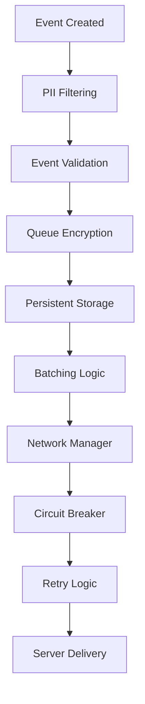

# Queue Management Guide

Deep dive into LuxAnalytics' event queue mechanics, optimization, and management.

## Overview

LuxAnalytics uses a sophisticated event queue system that ensures reliable event delivery while respecting device resources and user privacy. The queue is encrypted, persistent, and designed for offline-first operation.

## Queue Architecture

### Core Components



### Queue Properties

| Property | Default | Purpose |
|----------|---------|---------|
| `maxQueueSize` | 500 events | Soft limit triggering auto-flush |
| `maxQueueSizeHard` | 10,000 events | Hard limit before dropping events |
| `batchSize` | 50 events | Events per network request |
| `eventTTL` | 7 days | Event expiration time |
| `autoFlushInterval` | 30 seconds | Automatic flush frequency |

## Queue Operations

### Event Queuing Process

```swift
// Internal queue process (automatic)
1. Event created by app
2. PII filtering applied
3. Event validation performed
4. AES-GCM encryption
5. Write to persistent storage
6. Check queue size limits
7. Trigger flush if needed
```

### Manual Queue Management

```swift
// Get queue statistics
let stats = await LuxAnalytics.getQueueStats()
print("Total events: \(stats.totalEvents)")
print("Queue size: \(stats.totalSizeBytes) bytes")
print("Retriable events: \(stats.retriableEvents)")
print("Expired events: \(stats.expiredEvents)")
print("Oldest event age: \(stats.oldestEventAge) seconds")

// Manual flush
await LuxAnalytics.flush()

// Clear entire queue (use with caution)
await LuxAnalytics.clearQueue()

// Health check
let isHealthy = await LuxAnalytics.healthCheck()
```

### Queue Stats Deep Dive

```swift
struct QueueStats {
    let totalEvents: Int           // All events in queue
    let retriableEvents: Int       // Events eligible for retry
    let expiredEvents: Int         // Events past TTL
    let failedEvents: Int          // Events that failed max retries
    let totalSizeBytes: Int        // Total queue size in bytes
    let oldestEventAge: TimeInterval // Age of oldest event
    let averageEventSize: Int      // Average event size in bytes
    let compressionRatio: Double   // Compression effectiveness
    let encryptionOverhead: Int    // Encryption size overhead
}

// Advanced queue analysis
let stats = await LuxAnalytics.getQueueStats()

if stats.expiredEvents > 0 {
    print("⚠️ \(stats.expiredEvents) events have expired")
}

if stats.totalSizeBytes > 1_000_000 { // 1MB
    print("⚠️ Large queue size: \(ByteCountFormatter.string(fromByteCount: Int64(stats.totalSizeBytes), countStyle: .file))")
}

let healthRatio = Double(stats.retriableEvents) / Double(stats.totalEvents)
if healthRatio < 0.8 {
    print("⚠️ Queue health poor: \(Int(healthRatio * 100))% retriable")
}
```

## Queue Configuration

### Basic Configuration

```swift
let config = try LuxAnalyticsConfiguration(
    dsn: "your-dsn",
    
    // Queue size management
    maxQueueSize: 1000,           // Trigger flush at 1000 events
    maxQueueSizeHard: 20000,      // Hard limit at 20K events
    batchSize: 100,               // 100 events per request
    
    // Time-based management
    autoFlushInterval: 60.0,      // Flush every minute
    eventTTL: 86400 * 3,          // 3 days TTL
    
    // Overflow handling
    overflowStrategy: .dropOldest // Drop oldest when full
)
```

### Advanced Queue Tuning

```swift
// High-frequency app (games, social media)
let highFrequencyConfig = try LuxAnalyticsConfiguration(
    dsn: "your-dsn",
    maxQueueSize: 200,            // Smaller queue, frequent flushes
    batchSize: 100,               // Large batches for efficiency
    autoFlushInterval: 15.0,      // Flush every 15 seconds
    compressionEnabled: true,     // Essential for large batches
    compressionThreshold: 512     // Compress smaller payloads
)

// Low-frequency app (productivity, utilities)
let lowFrequencyConfig = try LuxAnalyticsConfiguration(
    dsn: "your-dsn",
    maxQueueSize: 50,             // Small queue sufficient
    batchSize: 25,                // Smaller batches
    autoFlushInterval: 300.0,     // Flush every 5 minutes
    eventTTL: 86400 * 7           // Longer retention
)

// Offline-heavy app (travel, field work)
let offlineConfig = try LuxAnalyticsConfiguration(
    dsn: "your-dsn",
    maxQueueSize: 2000,           // Large queue for offline storage
    maxQueueSizeHard: 50000,      // Very large hard limit
    batchSize: 200,               // Large batches when online
    eventTTL: 86400 * 14,         // 2 weeks retention
    maxRetryAttempts: 10          // More retry attempts
)
```

## Overflow Strategies

### DropOldest (Default)

```swift
// When queue reaches maxQueueSizeHard:
// 1. Remove oldest 10% of events
// 2. Add new event
// 3. Log dropped count

let config = try LuxAnalyticsConfiguration(
    dsn: "your-dsn",
    overflowStrategy: .dropOldest
)

// Good for: Real-time analytics where recent data matters most
```

### DropNewest

```swift
// When queue reaches maxQueueSizeHard:
// 1. Reject new event
// 2. Keep existing queue intact
// 3. Log rejection

let config = try LuxAnalyticsConfiguration(
    dsn: "your-dsn",
    overflowStrategy: .dropNewest
)

// Good for: Critical event preservation, compliance logging
```

### DropAll

```swift
// When queue reaches maxQueueSizeHard:
// 1. Clear entire queue
// 2. Add new event as first item
// 3. Log massive drop

let config = try LuxAnalyticsConfiguration(
    dsn: "your-dsn",
    overflowStrategy: .dropAll
)

// Good for: Emergency reset, memory-constrained devices
```

## Queue Monitoring

### Real-time Queue Monitoring

```swift
class QueueMonitor: ObservableObject {
    @Published var queueStats: QueueStats?
    @Published var alerts: [QueueAlert] = []
    
    private var monitoringTask: Task<Void, Never>?
    
    func startMonitoring() {
        monitoringTask = Task {
            while !Task.isCancelled {
                await updateStats()
                try? await Task.sleep(for: .seconds(30))
            }
        }
    }
    
    func stopMonitoring() {
        monitoringTask?.cancel()
    }
    
    private func updateStats() async {
        let stats = await LuxAnalytics.getQueueStats()
        
        await MainActor.run {
            self.queueStats = stats
            self.checkAlerts(stats)
        }
    }
    
    private func checkAlerts(_ stats: QueueStats) {
        alerts.removeAll()
        
        // Size alerts
        if stats.totalSizeBytes > 5_000_000 { // 5MB
            alerts.append(.largeSizeWarning(stats.totalSizeBytes))
        }
        
        // Age alerts
        if stats.oldestEventAge > 86400 { // 24 hours
            alerts.append(.oldEventsWarning(stats.oldestEventAge))
        }
        
        // Health alerts
        let healthRatio = Double(stats.retriableEvents) / Double(stats.totalEvents)
        if healthRatio < 0.5 {
            alerts.append(.poorHealthWarning(healthRatio))
        }
        
        // Expiry alerts
        if stats.expiredEvents > 10 {
            alerts.append(.expiredEventsWarning(stats.expiredEvents))
        }
    }
}

enum QueueAlert {
    case largeSizeWarning(Int)
    case oldEventsWarning(TimeInterval)
    case poorHealthWarning(Double)
    case expiredEventsWarning(Int)
}
```

### Event Stream Monitoring

```swift
class QueueEventMonitor {
    static func startMonitoring() {
        Task {
            for await event in LuxAnalyticsEvents.eventStream {
                await handleQueueEvent(event)
            }
        }
    }
    
    private static func handleQueueEvent(_ event: LuxAnalyticsEventType) async {
        switch event {
        case .eventQueued(let analyticsEvent):
            await trackQueueGrowth()
            
        case .eventsSent(let events):
            await trackSuccessfulFlush(events.count)
            
        case .eventsFailed(let events, let error):
            await trackFailedFlush(events.count, error: error)
            
        case .eventsDropped(let count, let reason):
            await trackDroppedEvents(count, reason: reason)
            
        case .eventsExpired(let events):
            await trackExpiredEvents(events.count)
        }
    }
    
    private static func trackQueueGrowth() async {
        let stats = await LuxAnalytics.getQueueStats()
        
        if stats.totalEvents > 800 { // Approaching default limit of 1000
            print("⚠️ Queue approaching capacity: \(stats.totalEvents) events")
        }
    }
    
    private static func trackSuccessfulFlush(_ count: Int) async {
        print("✅ Successfully sent \(count) events")
    }
    
    private static func trackFailedFlush(_ count: Int, error: Error) async {
        print("❌ Failed to send \(count) events: \(error)")
        
        // Trigger emergency flush if too many failures
        let stats = await LuxAnalytics.getQueueStats()
        if stats.failedEvents > 100 {
            print("🚨 High failure rate, triggering emergency flush")
            await LuxAnalytics.flush()
        }
    }
}
```

## Queue Performance Optimization

### Memory Optimization

```swift
// Monitor memory usage
class QueueMemoryManager {
    static func optimizeForMemoryPressure() async {
        let stats = await LuxAnalytics.getQueueStats()
        
        // If queue is large, flush immediately
        if stats.totalSizeBytes > 2_000_000 { // 2MB
            print("📱 Memory pressure: flushing large queue")
            await LuxAnalytics.flush()
        }
        
        // If too many events, enable aggressive compression
        if stats.totalEvents > 1000 {
            await enableAggressiveCompression()
        }
        
        // Clean up expired events
        if stats.expiredEvents > 50 {
            await cleanupExpiredEvents()
        }
    }
    
    private static func enableAggressiveCompression() async {
        // This would require SDK configuration update
        print("📦 Enabling aggressive compression for large queue")
    }
    
    private static func cleanupExpiredEvents() async {
        print("🧹 Cleaning up expired events")
        // The SDK handles this automatically, but we can trigger it
        await LuxAnalytics.getQueueStats() // Triggers internal cleanup
    }
}

// React to memory warnings
extension QueueMemoryManager {
    static func handleMemoryWarning() async {
        print("⚠️ Memory warning received, optimizing queue")
        await optimizeForMemoryPressure()
    }
}

// Usage in app delegate
func applicationDidReceiveMemoryWarning(_ application: UIApplication) {
    Task {
        await QueueMemoryManager.handleMemoryWarning()
    }
}
```

### Network Optimization

```swift
class QueueNetworkOptimizer {
    static func optimizeForNetworkConditions() async {
        let isConnected = await LuxAnalytics.isNetworkAvailable()
        let stats = await LuxAnalytics.getQueueStats()
        
        if isConnected {
            await handleOnlineOptimization(stats)
        } else {
            await handleOfflineOptimization(stats)
        }
    }
    
    private static func handleOnlineOptimization(_ stats: QueueStats) async {
        // Large queue when online - flush aggressively
        if stats.totalEvents > 100 {
            print("📡 Online with large queue, flushing")
            await LuxAnalytics.flush()
        }
        
        // Old events when online - clear immediately
        if stats.oldestEventAge > 3600 { // 1 hour
            print("📡 Online with old events, flushing")
            await LuxAnalytics.flush()
        }
    }
    
    private static func handleOfflineOptimization(_ stats: QueueStats) async {
        // Offline - ensure we don't hit storage limits
        if stats.totalEvents > 5000 {
            print("📱 Offline with very large queue, may need cleanup")
            // Consider implementing custom cleanup logic
        }
        
        // Monitor storage space
        if stats.totalSizeBytes > 10_000_000 { // 10MB
            print("💾 Large offline storage, monitoring space")
        }
    }
}
```

### Batch Size Optimization

```swift
class BatchSizeOptimizer {
    static func optimizeBatchSize() async {
        let stats = await LuxAnalytics.getQueueStats()
        let networkConditions = await assessNetworkConditions()
        
        let recommendedBatchSize = calculateOptimalBatchSize(
            queueSize: stats.totalEvents,
            averageEventSize: stats.averageEventSize,
            networkConditions: networkConditions
        )
        
        print("📊 Recommended batch size: \(recommendedBatchSize)")
        // Note: Batch size is set at configuration time
    }
    
    private static func calculateOptimalBatchSize(
        queueSize: Int,
        averageEventSize: Int,
        networkConditions: NetworkConditions
    ) -> Int {
        switch networkConditions {
        case .wifi:
            // Fast network - larger batches
            return min(200, queueSize)
            
        case .cellular:
            // Cellular - moderate batches
            return min(100, queueSize)
            
        case .slow:
            // Slow network - smaller batches
            return min(25, queueSize)
            
        case .offline:
            // Offline - no batching needed
            return 0
        }
    }
    
    private static func assessNetworkConditions() async -> NetworkConditions {
        // Assess current network quality
        let isConnected = await LuxAnalytics.isNetworkAvailable()
        
        if !isConnected {
            return .offline
        }
        
        // Additional network quality assessment would go here
        // For now, assume good conditions
        return .wifi
    }
}

enum NetworkConditions {
    case wifi
    case cellular
    case slow
    case offline
}
```

## Queue Debugging

### Debug Queue State

```swift
#if DEBUG
extension LuxAnalytics {
    static func debugQueueState() async {
        let stats = await getQueueStats()
        
        print("🔍 Queue Debug Information")
        print("═══════════════════════════")
        print("Total Events: \(stats.totalEvents)")
        print("Retriable Events: \(stats.retriableEvents)")
        print("Expired Events: \(stats.expiredEvents)")
        print("Failed Events: \(stats.failedEvents)")
        print("Total Size: \(ByteCountFormatter.string(fromByteCount: Int64(stats.totalSizeBytes), countStyle: .file))")
        print("Average Event Size: \(stats.averageEventSize) bytes")
        print("Compression Ratio: \(String(format: "%.2f", stats.compressionRatio))")
        print("Oldest Event Age: \(formatDuration(stats.oldestEventAge))")
        
        // Health assessment
        let healthScore = calculateQueueHealth(stats)
        print("Health Score: \(String(format: "%.1f", healthScore * 100))%")
        
        if healthScore < 0.8 {
            print("⚠️ Queue health needs attention")
        }
    }
    
    private static func calculateQueueHealth(_ stats: QueueStats) -> Double {
        guard stats.totalEvents > 0 else { return 1.0 }
        
        let retriableRatio = Double(stats.retriableEvents) / Double(stats.totalEvents)
        let freshRatio = stats.oldestEventAge < 3600 ? 1.0 : 0.5 // Penalty for old events
        let sizeRatio = stats.totalSizeBytes < 1_000_000 ? 1.0 : 0.8 // Penalty for large size
        
        return (retriableRatio + freshRatio + sizeRatio) / 3.0
    }
    
    private static func formatDuration(_ seconds: TimeInterval) -> String {
        if seconds < 60 {
            return "\(Int(seconds))s"
        } else if seconds < 3600 {
            return "\(Int(seconds / 60))m"
        } else {
            return "\(String(format: "%.1f", seconds / 3600))h"
        }
    }
}
#endif
```

### Queue Validation

```swift
#if DEBUG
class QueueValidator {
    static func validateQueueIntegrity() async -> [QueueIssue] {
        var issues: [QueueIssue] = []
        
        let stats = await LuxAnalytics.getQueueStats()
        
        // Validate queue size consistency
        if stats.totalEvents < stats.retriableEvents + stats.expiredEvents + stats.failedEvents {
            issues.append(.inconsistentCounts)
        }
        
        // Validate size calculations
        let expectedMinSize = stats.totalEvents * 100 // Assume min 100 bytes per event
        if stats.totalSizeBytes < expectedMinSize {
            issues.append(.suspiciousSizeCalculation)
        }
        
        // Validate compression ratio
        if stats.compressionRatio > 10.0 || stats.compressionRatio < 0.1 {
            issues.append(.unusualCompressionRatio(stats.compressionRatio))
        }
        
        // Validate event age
        if stats.oldestEventAge < 0 {
            issues.append(.negativeEventAge)
        }
        
        return issues
    }
}

enum QueueIssue {
    case inconsistentCounts
    case suspiciousSizeCalculation
    case unusualCompressionRatio(Double)
    case negativeEventAge
}
#endif
```

## Production Queue Management

### Queue Health Monitoring

```swift
class ProductionQueueManager {
    static func setupHealthMonitoring() {
        Task {
            while true {
                await performHealthCheck()
                try? await Task.sleep(for: .minutes(5))
            }
        }
    }
    
    private static func performHealthCheck() async {
        let stats = await LuxAnalytics.getQueueStats()
        let isHealthy = await LuxAnalytics.healthCheck()
        
        // Log metrics for monitoring systems
        logQueueMetrics(stats)
        
        // Take action on unhealthy queue
        if !isHealthy {
            await handleUnhealthyQueue(stats)
        }
        
        // Proactive maintenance
        await performMaintenance(stats)
    }
    
    private static func logQueueMetrics(_ stats: QueueStats) {
        // Log to your monitoring system (DataDog, New Relic, etc.)
        print("METRICS queue_size=\(stats.totalEvents) queue_bytes=\(stats.totalSizeBytes) expired_events=\(stats.expiredEvents)")
    }
    
    private static func handleUnhealthyQueue(_ stats: QueueStats) async {
        print("🚨 Unhealthy queue detected, taking corrective action")
        
        // Emergency flush
        await LuxAnalytics.flush()
        
        // If still unhealthy after flush, clear queue
        let newStats = await LuxAnalytics.getQueueStats()
        if newStats.totalEvents > 1000 {
            print("🚨 Emergency queue clear")
            await LuxAnalytics.clearQueue()
        }
    }
    
    private static func performMaintenance(_ stats: QueueStats) async {
        // Proactive flush for large queues
        if stats.totalEvents > 300 {
            await LuxAnalytics.flush()
        }
        
        // Clean up if too much expired data
        if stats.expiredEvents > 20 {
            // Expired events are cleaned automatically, but we can trigger it
            _ = await LuxAnalytics.getQueueStats()
        }
    }
}
```

### Queue Alerts

```swift
class QueueAlertManager {
    static func checkForAlerts() async {
        let stats = await LuxAnalytics.getQueueStats()
        
        // Size alerts
        if stats.totalSizeBytes > 5_000_000 { // 5MB
            await sendAlert(.queueSizeLarge(stats.totalSizeBytes))
        }
        
        // Event count alerts
        if stats.totalEvents > 2000 {
            await sendAlert(.queueCountHigh(stats.totalEvents))
        }
        
        // Age alerts
        if stats.oldestEventAge > 86400 { // 24 hours
            await sendAlert(.eventsAging(stats.oldestEventAge))
        }
        
        // Health alerts
        let healthRatio = Double(stats.retriableEvents) / Double(stats.totalEvents)
        if healthRatio < 0.5 {
            await sendAlert(.queueUnhealthy(healthRatio))
        }
    }
    
    private static func sendAlert(_ alert: QueueAlert) async {
        // Send to monitoring/alerting system
        switch alert {
        case .queueSizeLarge(let size):
            print("🚨 ALERT: Queue size large: \(ByteCountFormatter.string(fromByteCount: Int64(size), countStyle: .file))")
            
        case .queueCountHigh(let count):
            print("🚨 ALERT: Queue count high: \(count) events")
            
        case .eventsAging(let age):
            print("🚨 ALERT: Events aging: oldest is \(age/3600) hours old")
            
        case .queueUnhealthy(let ratio):
            print("🚨 ALERT: Queue unhealthy: \(Int(ratio*100))% retriable")
        }
    }
}

enum QueueAlert {
    case queueSizeLarge(Int)
    case queueCountHigh(Int)
    case eventsAging(TimeInterval)
    case queueUnhealthy(Double)
}
```

## Best Practices

### ✅ Do

- Monitor queue stats regularly in production
- Set appropriate queue size limits for your app's usage
- Use compression for apps with large events
- Implement overflow strategies that match your use case
- Monitor for expired events and failed batches
- Flush manually during app backgrounding
- Clear queue on user logout (privacy)

### ❌ Don't

- Set extremely large hard limits (memory usage)
- Ignore queue health warnings
- Clear queue unnecessarily (data loss)
- Set very small batch sizes (inefficient)
- Set very long TTL without cleanup
- Forget to handle offline scenarios
- Ignore memory pressure warnings

## Next Steps

- [⚡ Performance Optimization](Performance.md) - Advanced performance tuning
- [📡 Network & Offline](Network-Offline.md) - Network handling strategies
- [🛡️ Error Handling](Error-Handling.md) - Comprehensive error management
- [💡 Best Practices](Best-Practices.md) - Production-ready patterns